# chacha20-py

A clean Python implementation of the ChaCha20 stream cipher from scratch, following [RFC 8439](https://datatracker.ietf.org/doc/html/rfc8439).

Built entirely from 32-bit integer additions, XOR, and bitwise rotations — no lookup tables, no S-boxes.

---

## Table of Contents

- [What is ChaCha20?](#what-is-chacha20)
- [How It Works](#how-it-works)
  - [Inputs](#inputs)
  - [The State Matrix](#the-state-matrix)
  - [The Quarter Round](#the-quarter-round)
  - [ARX — Add, Rotate, XOR](#arx--add-rotate-xor)
  - [Column and Diagonal Rounds](#column-and-diagonal-rounds)
  - [The Block Function](#the-block-function)
  - [Encryption](#encryption)
- [Project Structure](#project-structure)
- [Usage](#usage)
- [Run Tests](#run-tests)

---

## What is ChaCha20?

ChaCha20 is a **stream cipher** designed by Daniel J. Bernstein (djb) in 2008. Unlike block ciphers like AES, it does not encrypt fixed-size chunks of plaintext directly. Instead it generates a **pseudorandom keystream** of any length, which is then XOR'd with the plaintext byte by byte.

```
ciphertext = plaintext XOR keystream
plaintext  = ciphertext XOR keystream   ← same operation, XOR is its own inverse
```

This means **encryption and decryption are identical operations** — just XOR with the same keystream.

ChaCha20 is used in TLS 1.3, WireGuard, SSH, and QUIC. It is preferred over AES on devices without hardware AES acceleration (mobile, embedded) because it is fast in pure software and has no timing side-channel vulnerabilities.

---

## How It Works



---

### Inputs

ChaCha20 takes three inputs:

| Input | Size | Purpose |
|---|---|---|
| **Key** | 32 bytes (256 bits) | Secret. Never share or reuse. |
| **Nonce** | 12 bytes (96 bits) | Public but must be unique per message. Reusing a nonce with the same key is catastrophic. |
| **Counter** | 4 bytes (32 bits) | Starts at 0 or 1. Increments by 1 for each 64-byte block. |

---

### The State Matrix

Before any mixing happens, ChaCha20 builds a **4×4 matrix of 32-bit words** (16 words × 4 bytes = 64 bytes total) from the inputs:

```
┌─────────────────────────────────────────────┐
│  Word index:  [ 0]  [ 1]  [ 2]  [ 3]        │
│               [ 4]  [ 5]  [ 6]  [ 7]        │
│               [ 8]  [ 9]  [10]  [11]        │
│               [12]  [13]  [14]  [15]        │
├─────────────────────────────────────────────┤
│  Semantics:   [C0]  [C1]  [C2]  [C3]  ← constants ("expand 32-byte k")
│               [K0]  [K1]  [K2]  [K3]  ← key bytes  0–15
│               [K4]  [K5]  [K6]  [K7]  ← key bytes 16–31
│               [CTR] [N0]  [N1]  [N2]  ← counter + nonce
└─────────────────────────────────────────────┘
```

**Row 0 — Magic Constants**

The first 4 words are always fixed. They come from the ASCII string `"expand 32-byte k"` split into four 32-bit little-endian words:

```
"expa" → 0x61707865
"nd 3" → 0x3320646E
"2-by" → 0x79622D32
"te k" → 0x6B206574
```

These are called "nothing-up-my-sleeve" numbers — publicly known, chosen to prove no hidden backdoor was inserted.

**Rows 1–2 — Key**

The 32-byte key is split into 8 words of 4 bytes each, loaded in **little-endian** order. Little-endian means the least significant byte comes first:

```
key bytes: 00 01 02 03  →  word = 0x03020100  (not 0x00010203)
```

**Row 3 — Counter + Nonce**

The counter occupies word 12. The 12-byte nonce fills words 13–15.

---

### The Quarter Round

The quarter round is the **core mixing operation** of ChaCha20. Everything else is just applying it repeatedly in different patterns.

It takes **4 words (a, b, c, d)** and mixes them together using 8 operations:

```
Step 1:  a += b        d ^= a        d <<<= 16
Step 2:  c += d        b ^= c        b <<<= 12
Step 3:  a += b        d ^= a        d <<<= 8
Step 4:  c += d        b ^= c        b <<<= 7
```

After these 8 operations, every output bit depends on every input bit. This property is called **diffusion**.

---

### ARX — Add, Rotate, XOR

Each step in the quarter round is made of exactly three primitive operations. This is the **ARX** design:

#### Add (`+=`) — mod 2³²

Addition introduces **non-linearity** through carry propagation. When two bits add and produce a carry, that carry affects the next bit — creating a chain reaction that is hard to reverse or predict.

All additions are **mod 2³²**, meaning if the result exceeds 32 bits, it wraps around:

```
0xFFFFFFFF + 1 = 0x00000000   ← wraps back to 0
```

In Python this is just `(a + b) & 0xFFFFFFFF`.

#### XOR (`^=`) — bitwise

XOR **mixes** two words together at the bit level. Each output bit depends on exactly two input bits. XOR is its own inverse:

```
d ^= a    →   d is now mixed with a
d ^= a    →   d is restored (XOR twice = original)
```

This is also how decryption works in ChaCha20 — XOR the ciphertext with the same keystream to get the plaintext back.

#### Rotate Left (`<<<=`) — circular shift

Rotation **spreads** bits across different positions so that no single bit position dominates. Unlike a regular left shift (which loses the top bits), rotation wraps the bits that fall off the top back to the bottom:

```
rotate_left(0x80000000, 1) = 0x00000001   ← MSB wraps to LSB
rotate_left(0x12345678, 16) = 0x56781234  ← top and bottom halves swap
```

Formula: `((value << n) | (value >> (32 - n))) & 0xFFFFFFFF`

The specific rotation amounts in ChaCha20 are **16, 12, 8, 7** — chosen by Bernstein through analysis to maximize diffusion speed.

**Why all three together?**

| Operation | Alone | Problem |
|---|---|---|
| XOR only | Linear | Easy to analyze algebraically |
| Addition only | No bit spreading | Slow diffusion |
| Rotation only | No mixing between words | Not a cipher |
| **ARX combined** | Non-linear + fast diffusion | Hard to break, fast in software |

---

### Column and Diagonal Rounds

A single quarter round mixes 4 words. But ChaCha20 has 16 words. To mix the entire state, the quarter round is applied to different groups of 4 words in two patterns:

**Column round** — applies QR to each vertical column of the 4×4 matrix:

```
QR( 0,  4,  8, 12)   QR( 1,  5,  9, 13)
QR( 2,  6, 10, 14)   QR( 3,  7, 11, 15)
```

**Diagonal round** — applies QR to each diagonal:

```
QR( 0,  5, 10, 15)   QR( 1,  6, 11, 12)
QR( 2,  7,  8, 13)   QR( 3,  4,  9, 14)
```

Column round + diagonal round = **1 double round**.

The diagonal pattern (added by Bernstein over his earlier Salsa20 cipher) ensures mixing propagates across columns — without it, words in different columns would never interact.

ChaCha**20** applies **10 double rounds = 20 total quarter-round passes**.

---

### The Block Function

One full block of keystream (64 bytes) is generated like this:

```
key + nonce + counter
        │
        ▼
  chacha20_init_state()
        │
        ▼
  initial_state (16 words)
        │
        ├──────────────────────┐
        │                      │ copy
        ▼                      ▼
  working_state          initial_state (kept)
        │
        ▼
  double_round() × 10
        │
        ▼
  working_state[i] += initial_state[i]  (mod 2³², for all 16 words)
        │
        ▼
  serialize to 64 bytes (little-endian)
        │
        ▼
  64-byte keystream block
```

The final addition of the initial state back into the working state is critical — it makes the block function **one-way**. Even if an attacker sees the output, they cannot reverse the 20 rounds because they don't know the initial state (which contains the secret key).

---

### Encryption

For messages longer than 64 bytes, ChaCha20 generates multiple keystream blocks. The counter increments by 1 for each block:

```
Block 0:  chacha20_block(key, nonce, counter + 0)  →  keystream[0:64]
Block 1:  chacha20_block(key, nonce, counter + 1)  →  keystream[64:128]
Block 2:  chacha20_block(key, nonce, counter + 2)  →  keystream[128:192]
...
```

Each 64-byte chunk of plaintext is XOR'd with the corresponding keystream block. The last chunk may be shorter — only the bytes needed are used, the rest of the keystream is discarded.

**Critical security rule:** Never reuse a (key, nonce) pair. If two different messages are encrypted with the same key and nonce, an attacker can XOR the two ciphertexts together and cancel out the keystream entirely, revealing information about both plaintexts.

---

## Project Structure

```
chacha20/
├── constants.py   # Magic constants ("expand 32-byte k")
├── primitives.py  # rotate_left_32, quarter_round
├── state.py       # chacha20_init_state, serialize_state
├── block.py       # double_round, chacha20_block
└── cipher.py      # chacha20_encrypt, chacha20_decrypt
```

---

## Usage

```python
from chacha20.cipher import chacha20_encrypt, chacha20_decrypt

key   = bytes(range(32))   # 32 bytes
nonce = bytes(range(12))   # 12 bytes — never reuse with same key

ct = chacha20_encrypt(b"Hello, ChaCha20!", key, nonce, counter=1)
pt = chacha20_decrypt(ct, key, nonce, counter=1)
```

---

## Run Tests

```bash
pytest tests/ -v
```

All 13 tests verified against official RFC 8439 test vectors.

---

## Reference

- [RFC 8439 — ChaCha20 and Poly1305 for IETF Protocols](https://datatracker.ietf.org/doc/html/rfc8439)
- [Daniel J. Bernstein — ChaCha, a variant of Salsa20](https://cr.yp.to/chacha.html)